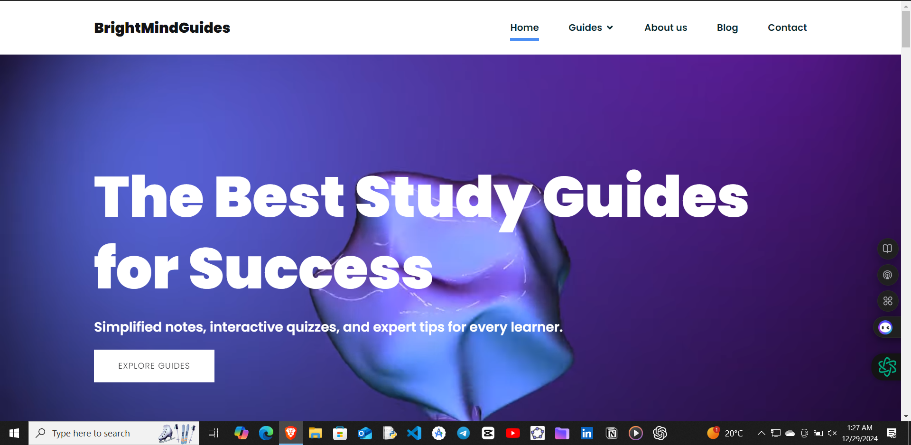
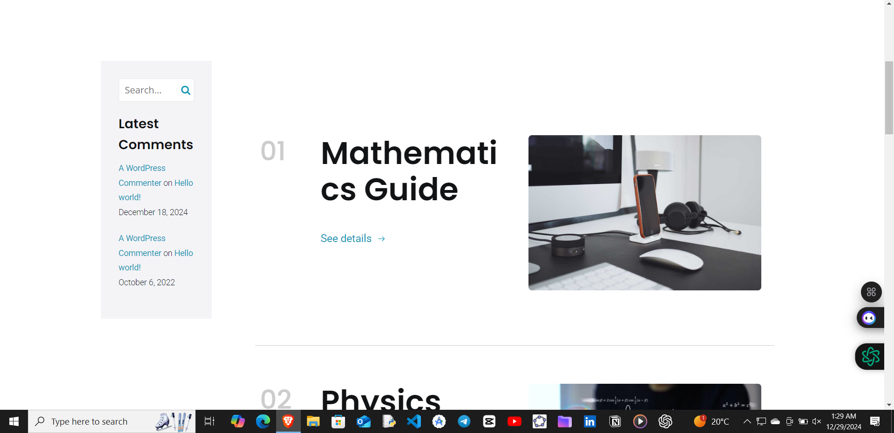
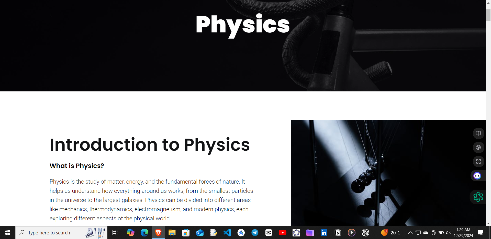

### BrightStudyGuide 📚✨  

**BrightStudyGuide** is a comprehensive study companion website designed to support students in their academic journey. This platform provides curated resources, study guides, and interactive learning tools tailored to help students excel in their studies.  

#### Key Features 🌟  
- **Subject-Based Study Materials**: Organized and accessible study resources for various subjects, with a focus on quality and relevance.  
- **User-Friendly Design**: Clean and responsive interface for seamless navigation across devices.  
- **Interactive Learning Tools**: Quizzes, practice questions, and flashcards to reinforce learning.  
- **Free Access**: Open for students who are eager to learn and achieve academic success.  
- **Customizable Resources**: Tailored materials designed to cater to different learning styles.  

#### About the Project 🛠️  
BrightStudyGuide was built using modern web technologies, leveraging **HTML5**, **CSS3**, and **JavaScript** for a smooth and interactive user experience. The website focuses on empowering students with resources they need to succeed, whether for daily studies, exam prep, or lifelong learning.  

This project is hosted on kubio and reflects my commitment to making education accessible and enjoyable for all.  

Feel free to check it out and contribute if you'd like to improve it further! 🌟  

#### Demo Link 🌐  
[BrightStudyGuide Live](https://leul-ayfokru-space.wpkubio.com/brightmindguides/)  

#### Technologies Used 🚀  
- **Frontend**: Kubio ai  
- **Hosting**: Kubio and wordpress

#### Contributions  
Contributions are welcome! Please fork the repository and submit a pull request to suggest improvements.  

---

**Made with ❤️ by Leul Ayfokru**
